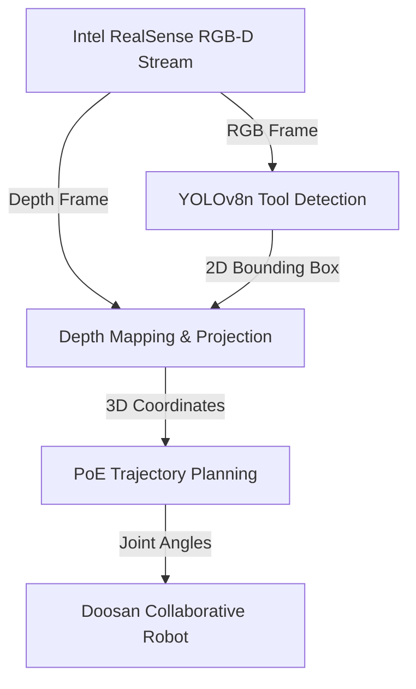

# Surgical Robotics: Vision-Guided Autonomous Soft-Tissue Manipulation
   

## Overview
A computer vision pipeline designed for autonomous surgical tool guidance during soft-tissue manipulation. It fine-tunes a YOLOv8n object detection model on a custom dataset of 1,247 annotated images, mapping 2D bounding boxes to 3D coordinates using Intel RealSense Depth API with OpenCV on an Intel NUC i7-1260P running an Ubuntu 22.04 LTS real-time kernel (28ms inference, 5ms depth mapping).

## System Architecture


## Features
- Tool detection using custom-trained YOLOv8n (nano) model trained on 1,247 annotated frames.
- 3D spatial mapping by projecting 2D bounding boxes to 3D coordinate space using Intel RealSense Depth API and OpenCV.
- Real-time performance benchmarked at 28ms inference and 5ms depth mapping on Intel NUC i7-1260P.

## Tech Stack
- PyTorch & YOLOv8 computer vision models
- Intel RealSense Depth API (D435/D455 structured-light cameras)
- OpenCV for frame processing and pixel projection matrices
- ROS2 Humble and MoveIt 2 robot control stacks

## Getting Started
To configure and run the project locally, clone the repository and execute the setup instructions:

```bash
git clone https://github.com/Raghuram-sekar/Surgical-Robotics-Tissue-Manipulation.git
cd Surgical-Robotics-Tissue-Manipulation

# Execute local setup commands:
# Projective Geometry Coordinate Projection:
# lambda * [u; v; 1] = K * [R | t] * P

# Product of Exponentials Forward Kinematics:
# T(q) = exp([S_1]*theta_1) * ... * exp([S_n]*theta_n) * M

pip install ultralytics opencv-python pyrealsense2
```
