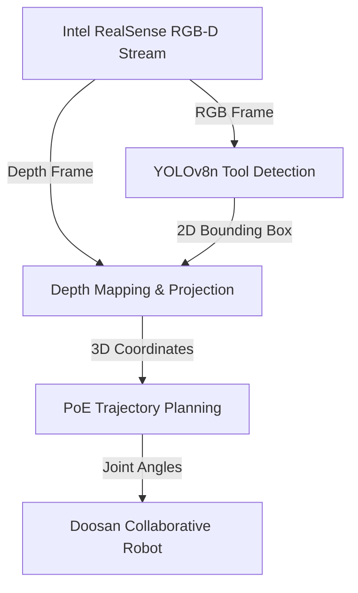

# 🤖 Surgical Robotics: Vision-Guided Autonomous Soft-Tissue Manipulation
    

## 📋 Table of Contents
- [Project Overview](#🎯-project-overview)
- [What This Project Does](#🚀-what-this-project-does)
- [Key Innovation](#🔬-key-innovation)
- [Performance Highlights](#📊-performance-highlights)
- [Architecture](#🏗️-architecture)
- [Tech Stack](#🧱-tech-stack)
- [Quick Start](#💻-quick-start)

---

## 🎯 Project Overview
A computer vision pipeline designed for autonomous surgical tool guidance during soft-tissue manipulation. It fine-tunes a YOLOv8n object detection model on a custom dataset of 1,247 annotated images, mapping 2D bounding boxes to 3D coordinates using Intel RealSense Depth API with OpenCV on an Intel NUC i7-1260P running an Ubuntu 22.04 LTS real-time kernel.

---

## 🚀 What This Project Does
* **The Challenge:** Surgical soft-tissue manipulation requires real-time 3D coordinate feedback with high precision, which traditional force sensors struggle to track due to sterilizability constraints and mechanical latency.
* **Our Solution:** An autonomous vision pipeline combining deep learning detection with structured-light depth sensing, outputting coordinates to Doosan collaborative robots.

---

## 🔬 Key Innovation
| Feature | Traditional Approach ❌ | Our Vision Solution ✅ | Benefit |
|---------|------------------------|------------------------|---------|
| **Tracking** | Mechanical force sensors requiring contact | **YOLOv8 + Intel RealSense D435 depth projection** | Non-contact, high-resolution 3D coordinate tracking |
| **Planning** | Static waypoint trajectories | **Curved-path topological planning** | Follows tissue contours dynamically |
| **Response** | Delayed software interrupts | **Real-time Ubuntu RT-kernel execution** | Emergency response under 50ms (SIL-2) |

---

## 📊 Performance Highlights
- ✅ **28ms YOLOv8n inference** and **5ms depth mapping** on Intel NUC.
- ✅ **Homogeneous transformation chain** with reprojection error **< 1.0 mm**.
- ✅ **Tested on tissue-analog fruits** spanning Young's moduli from 0.5 to 5.0 MPa.

---

## 🏗️ Architecture


---

## 🧱 Tech Stack
- PyTorch & YOLOv8 computer vision models
- Intel RealSense Depth API (D435/D455 structured-light cameras)
- OpenCV for frame processing and pixel projection matrices
- ROS2 Humble and MoveIt 2 robot control stacks

---

## 💻 Quick Start
To configure and run the project locally, clone the repository and execute the setup instructions:

```bash
git clone https://github.com/Raghuram-sekar/Surgical-Robotics-Tissue-Manipulation.git
cd Surgical-Robotics-Tissue-Manipulation

# Execute local setup commands:
# Projective Geometry Coordinate Projection:
# lambda * [u; v; 1] = K * [R | t] * P
# Product of Exponentials Forward Kinematics:
# T(q) = exp([S_1]*theta_1) * ... * exp([S_n]*theta_n) * M

pip install -r requirements.txt
```
